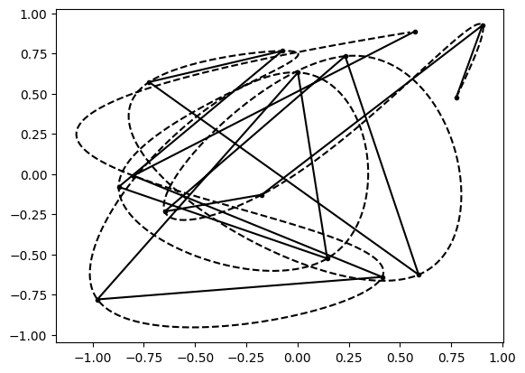
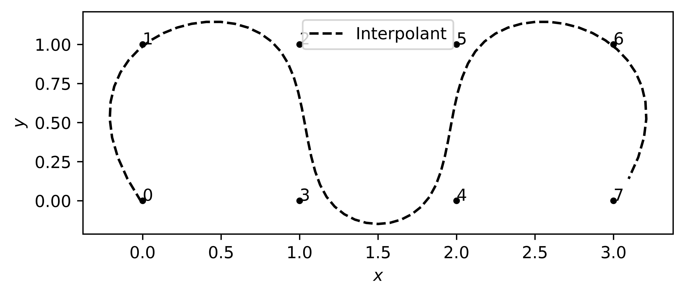

# Trajectories package

The solid lines represents the "coarse" or "wished" waypoints, coming from the operator (or potentially autonomy), and dashed represents the interpolant (in this case a cubic spline).

## Interp1D
```xml
<arg name="spline_degree" default="cubic" />
<arg name="waypoint_spacing" default="0.1" />
```


## B-Spline
https://scipy.github.io/devdocs/generated/scipy.interpolate.splprep.html#scipy.interpolate.splprep
```xml
<arg name="spline_degree" default="3" />
<arg name="smoothing_factor" default="0.1" />
<arg name="waypoint_spacing" default="0.1" />
```
